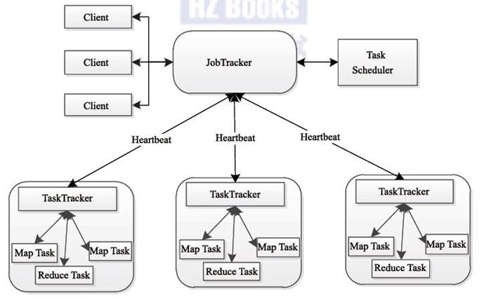
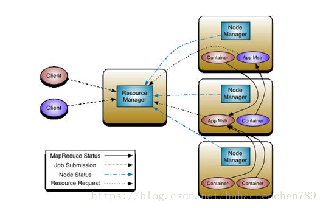

# HADOOP大数据教程

[TOC]

## 1. 大数据简介

### 1.1 大数据的由来

```
	随着计算机技术的发展，互联网的普及，信息的积累已经到了一个非常庞大的地步，信息的增长也在不断的加快，随着互联网、物联网建设的加快，信息更是爆炸式增长，收集、检索、统计这些信息越发困难，必须使用新的技术来解决这些问题
```

### 1.2 什么是大数据

```
【1】定义
	大数据指无法在一定时间范围内用常规软件工具进行捕捉、管理和处理的数据集合，需要新处理模式才能具有更强的决策力、洞察发现力和流程优化能力的海量、高增长率和多样化的信息资产
	
【2】总结
	大数据是指即从各种各样类型的数据中，获得有价值的信息
```

### 1.3 大数据特性

```
【1】大体量（Volume）
	数据体量大,一般从TB级别开始计算，可从数百TB到数十数百PB甚至EB的规模
	KB、MB、GB、TB、PB、EB、... ...
   1Byte = 8Bit
	1KB = 1024Bytes
	1MB = 1024K
	1GB = 1024M
	1TB = 1024G
	1PB = 1024T
	1EB = 1024P
	... ...
【2】多样性（Variety）
	数据的种类和来源多(多种异构数据源)
【3】时效性（Velocity）
	很多大数据需要在一定的时间限度下得到及时处理
【4】准确性（Veracity）
	处理的结果要保证一定的准确性
【5】大价值（Value）
	大数据包含很多深度的价值，大数据分析挖掘和利用将带来巨大的商业价值

【补充】
	数据的价值密度越来越低,但是这并不意味着想要的数据越来越少,相反我们想要的数据是越来越多，但是样本总量的增长速度是要高于想要的数据的增长速度的
```

### 1.4 大数据与Hadoop

```
【1】Hadoop是什么？
    1.1) Hadoop是一种分析和处理海量数据的软件平台
    1.2) Hadoop是一款开源软件，使用JAVA开发
    1.3) Hadoop可以提供一个分布式基础架构
```

### 1.5 带来的问题

```
【1】数据存储问题 - 存储速度、存储空间
【2】数据计算|分析问题 - 性能与效率问题

【说明】
	1、numpy、pandas、MySQL处理上GB的数据,如果处理TB、PB级别数据怎么办？
	2、传统企业解决
	3、谷歌解决方案:
	  使用MapReduce算法,将大任务分成小份,并将他们分配到多台计算机,并且能够从多台计算机收集并合并，得到最终的结果。
	  谷歌实现了分布式存储、分布式计算
```

## 2. Hadoop简介

### 2.1 Hadoop概述

#### 2.1.1 Hadoop概念

- **定义**

  Hadoop是Yahoo!开发，后贡献给了Apache开源软件基金会的一套开源的、可靠的、可扩展的用于分布式计算的框架

- **Hadoop作者** 

  Doug cutting

- **Hadoop名字由来** 

  以Hadoop作者的孩子的一个棕黄色的大象样子的玩具的命名

  


#### 2.1.2 Hadoop特点

- **高可靠性** 

  Hadoop按位存储和数据处理的能力值得信赖

- **高扩展性**

  Hadoop通过可用的计算机集群分配数据，完成存储和计算任务，这些集群可以方便地扩展到数以千计的节点中，具有高扩展性

- **高效性**

  Hadoop能够在节点之间进行动态地移动数据，并保证各个节点的动态平衡，处理速度非常快，具有高效性

- **高容错性**

  Hadoop能够自动保存数据的多个副本（默认是3个），并且能够自动将失败的任务重新分配


#### 2.1.3 Hadoop能做什么

- **大数据量存储**

  分布式存储（各种云盘，百度，360~还有云平台均有hadoop应用）

- **日志处理**

- **搜索引擎**

  如何存储持续增长的海量网页:  单节点 V.S. 分布式存储

  如何对持续增长的海量网页进行排序: 超算 V.S. 分布式计算

- **数据挖掘**

  目前比较流行的广告推荐

#### 2.1.4 Hadoop版本

- **Hadoop1.0**

  包含Common，HDFS和MapReduce，停止更新

- **Hadoop2.0**

  包含了Common，HDFS，MapReduce和YARN。Hadoop2.0和Hadoop1.0完全不兼容。

- **Hadoop3.0**

  包含了Common，HDFS，MapReduce，YARN。Hadoop3.0和Hadoop2.0是兼容的

### 2.2 Hadoop核心组件

- hadoop 的核心组件有四个
  1. **Hadoop Common**：支持其他 Hadoop 模块的通用实用程序。
  2. **Hadoop 分布式文件系统 (HDFS™)**：提供对应用程序数据的高吞吐量访问的分布式文件系统。
  3. **Hadoop YARN**：用于作业调度和集群资源管理的框架。
  4. **Hadoop MapReduce**：一个基于 YARN 的系统，用于并行处理大型数据集。

#### 2.2.1 HDFS（Hadoop Distributed File System）

- **HDFS**

  分布式存储，解决海量数据的存储

- **HDFS特点及原理**

  HDFS具有扩展性、容错性、海量数量存储的特点

  原理为将大文件切分成指定大小的数据块, 并在分布式的多台机器上保存多个副本

- **HDFS角色和概念**

  1. Client

     《1》切分文件

     《2》与NameNode交互获取元数据

     《3》与DataNode交互读取和写入数据

  2. NameNode

     《1》Master节点，管理HDFS的元数据信息

     《2》配置副本策略

     《3》处理所有客户端请求

  3. SecondaryNameNode

     《1》定期同步NameNode，紧急情况下，可转正

  4. DataNode

     《1》数据存储节点，存储实际的数据

     《2》汇报存储信息给NameNode

  5. Block

     每块默认128MB大小

     每块可以多个副本

- **HDFS示意图**

  

- **HDFS原理图**

  1、每个数据块3个副本，分布在两个机架内的节点，2个副本在同一个机架上，另外一个副本在另外的机架上

  

  2、心跳检测，datanode定期向namenode发送心跳消息。查看是否有datanode挂掉了

  ​								

  3、secondary namenode;定期同步元数据映像文件和修改日志，namenode发生故障，secondaryname会成为主namenode

  ​					

  

- **HDFS写文件流程**

  ```
  【1】客户端将文件拆分成固定大小128M的块，并通知namenode
  【2】namenode找到可用的datanode返回给客户端
  【3】客户端根据返回的datanode，对块进行写入
  【4】通过流水线管道流水线复制
  【5】更新元数据，告诉namenode已经完成了创建新的数据块，保证namenode中的元数据都是最新的状态
  ```

  ​	

- **HDFS读文件流程**

  ```
  【1】客户端向namenode发起读请求，把文件名，路径告诉namenode
  【2】namenode查询元数据，并把数据返回客户端
  【3】此时客户端就明白文件包含哪些块，这些块在哪些datanode中可以找到
  ```

  ​	

#### 2.2.2 MapReduce

- **MapReduce实现了分布式计算**

  Hadoop的MapReduce是对google三大论文的MapReduce的开源实现，实际上是一种编程模型，是一个分布式的计算框架，用于处理海量数据的运算，由JAVA实现

- **MapReduce原理图**

  

- **MapReduce角色及概念**

  1. JobTracker

     –Master节点只有一个

     –管理所有作业/任务的监控、错误处理等

     –将任务分解成一系列任务，并分派给TaskTracker

  2. TaskTracker

     –Slave节点，一般是多台

     –运行Map Task和Reduce Task

     –并与JobTracker交互，汇报任务状态

  3. Map Task

     –解析每条数据记录，传递给用户编写的map()并执行，将结果输出

  4. Reducer Task

     –从Map Task的执行结果中，远程读取输入数据，对数据进行排序，将数据按照分组传递给用户编写的reduce函数执行

#### 2.2.3 Yarn

- **作用**

  负责整个集群资源的管理和调度，是Hadoop的一个通用的资源管理系统

- **定义**

  Apache Hadoop YARN （Yet Another Resource Negotiator，另一种资源协调者）是一种新的 Hadoop 资源管理器，它是一个通用资源管理系统，可为上层应用提供统一的资源管理和调度，它的引入为集群在利用率、资源统一管理和数据共享等方面带来了巨大好处

- **原理图**

  

- **Yarn角色及概念**

  1. Resourcemanager
  
     –处理客户端请求 
  
     –启动/监控ApplicationMaster
  
     –监控NodeManager
  
     –资源分配与调度 
  
  2. Nodemanager
  
     –单个节点上的资源管理 
  
     –处理来自ResourceManager的命令 
  
     –处理来自ApplicationMaster的命令 
  
  3. ApplicationMaster
  
     –为应用程序申请资源，并分配给内部任务 
  
     –任务监控与容错 
  
  4. Container
  
     –对任务运⾏行环境的抽象，封装了CPU 、内存等
  
  5. Client
  
     –用户与Yarn交互的客户端程序 
  
     –提交应用程序、监控应用程序状态，杀死应用程序等 

### 2.3 Hadoop总结

#### 2.3.1 Hadoop组成

1. 分布式存储 - HDFS
2. 分布式计算 - MapReduce
3. 资源管理 - Yarn

#### 2.3.2 HDFS特点

- **HDFS优点**
  1. 高可靠性
  2. 高扩展性
  3. 高效性
  4. 高容错性
  5. 低成本 ：与一体机、商用数据仓库等相比，hadoop是开源的，项目的软件成本因此会大大降低

- **HDFS缺点**
  1. 不能做到低延迟，由于hadoop针对高数据吞吐量做了优化，牺牲了获取数据的延迟，所以对于低延迟数据访问，不适合hadoop
  2. 不适合大量小文件存储，由于namenode将文件系统的元数据存储在内存中，因此该文件系统所能存储的文件总数受限于namenode的内存容量，根据经验，每个文件、目录和数据块的存储信息大约占150字节
  4. 对于上传到HDFS上的文件，不支持修改文件，HDFS适合一次写入，多次读取的场景

#### 2.3.3 HDFS相关

- **名词**
  1. NameNode
  2. DataNode

- **写入文件流程**
  1. 客户端将文件拆分成固定大小128M的块，并通知namenode
  2. namenode找到可用的datanode返回给客户端
  3. 客户端根据返回的datanode，对块进行写入
  4. 通过流水线管道流水线复制
  5. 更新元数据，告诉namenode已经完成了创建新的数据块，保证namenode中的元数据都是最新的状态

- **读取文件流程**
  1. 客户端向namenode发起独立请求，把文件名，路径告诉namenode
  2. namenode查询元数据，并把数据返回客户端
  3. 此时客户端就明白文件包含哪些块，这些块在哪些datanode中可以找到

## 3. 环境安装

### 3.1 安装方式

- **单机模式**

  只能启动MapReduce

- **伪分布式**

  能启动HDFS、MapReduce 和 YARN的大部分功能

- **完全分布式**

  能启动Hadoop的所有功能

### 3.2 安装JDK

#### 3.2.1 JDK安装步骤

1. 下载JDK安装包（下载Linux系统的 .tar.gz 的安装包）

   https://www.oracle.com/java/technologies/javase/javase-jdk8-downloads.html

2. 更新Ubuntu源

   ```shell
   sudo apt-get update
   ```

3. 将JDK压缩包解压到Ubuntu系统中 /usr/local/ 中

   ```shell
   sudo tar -zxvf jdk-8u251-linux-x64.tar.gz -C /usr/local/
   ```

4. 将解压的文件夹重命名为 jdk8

   ```shell
   cd /usr/local/
   sudo mv jdk1.8.0_251/ jdk8
   ```

   

5. 添加到环境变量

   修改本用户的环境变量的配置文件

   ```shell
   cd /home/tarena/
   # 使用 gedit  或者 vim 打开 .bashrc 文件
   sudo gedit .bashrc
   ```

   在文件末尾添加如下内容:

   ```shell
   export JAVA_HOME=/usr/local/jdk8
   export JRE_HOME=$JAVA_HOME/jre
   export CLASSPATH=.:$JAVA_HOME/lib:$JRE_HOME/lib
   export PATH=.:$JAVA_HOME/bin:$PATH
   ```

   让配置文件生效

   ```shell
   source .bashrc
   ```

   

6. 验证是否安装成功

   ```shell
   java -version
   ```

   > 出现java的版本则证明安装并添加到环境变量成功
>
   > java version "1.8.0_251"

### 3.3 安装Hadoop并配置伪分布式

#### 3.3.1 Hadoop安装配置步骤

1. 安装SSH

   ```shell
   sudo apt-get install ssh
   ```

2. 配置免登录认证,避免使用Hadoop时的权限问题

   ```shell
ssh-keygen -t rsa   （输入此条命令后一路回车）
   cd ~/.ssh
cat id_rsa.pub >> authorized_keys
   ssh localhost   #（发现并未让输入密码即可连接）
exit   #（退出远程连接状态）
   ```

   

3. 下载Hadoop 2.10（374M）

   https://archive.apache.org/dist/hadoop/common/hadoop-2.10.0/hadoop-2.10.0.tar.gz

4. 解压到 /usr/local 目录中,并将文件夹重命名为 hadoop，最后设置权限

   ```shell
   sudo tar -zxvf hadoop-2.10.0.tar.gz -C /usr/local/
   cd /usr/local
   sudo mv hadoop-2.10.0/ hadoop2.10
   sudo chown -R tarena hadoop2.10/
   ```

   

5. 验证Hadoop

   ```shell
   cd /usr/local/hadoop2.10/bin
   ./hadoop version   # （此处出现hadoop的版本即为成功）
   ```

6. 设置JAVE_HOME环境变量

   修改文件

   ```shell
   sudo gedit /usr/local/hadoop2.10/etc/hadoop/hadoop-env.sh
   ```

   将JAVA_HOME变量改为 如下

   ```shell
   # 把原来的export JAVA_HOME=${JAVA_HOME}改为
   export JAVA_HOME=/usr/local/jdk8
   ```

7. 设置Hadoop环境变量

   修改本用户的环境变量的配置文件

   ```shell
   sudo gedit /home/tarena/.bashrc
   ```

   在末尾追加

   ```shell
   export HADOOP_HOME=/usr/local/hadoop2.10
   export CLASSPATH=.:{JAVA_HOME}/lib:${HADOOP_HOME}/sbin:$PATH
   export PATH=.:${HADOOP_HOME}/bin:${HADOOP_HOME}/sbin:$PATH
   ```

   让修改后的内容生效

   ```shell
   source /home/tarena/.bashrc
   ```

   

8. 伪分布式配置，修改2个配置文件（core-site.xml 和 hdfs-site.xml）

9. 修改 `core-site.xml`

   ```shell
   sudo gedit  /usr/local/hadoop2.10/etc/hadoop/core-site.xml
   ```

   添加如下内容

   ```html
   <configuration>
       <property>
           <!--数据目录配置参数-->
           <name>hadoop.tmp.dir</name>
           <value>file:/usr/local/hadoop2.10/tmp</value>
       </property>
       <property>
           <!--文件系统配置参数-->
           <name>fs.defaultFS</name>
           <value>hdfs://localhost:9000</value>
       </property>
   </configuration>
   ```

10. 修改hdfs-site.xml

   ```shell
   sudo gedit /usr/local/hadoop2.10/etc/hadoop/hdfs-site.xml
   ```

   添加如下内容

   ```html
   <configuration>
       <property>
           <!--副本数量-->
           <name>dfs.replication</name>
           <value>1</value>
       </property>
       <property>
           <!--namenode数据目录-->
           <name>dfs.namenode.name.dir</name>
           <value>file:/usr/local/hadoop2.10/tmp/dfs/name</value>
       </property>
       <property>
           <!--datanode数据目录-->
           <name>dfs.datanode.data.dir</name>
           <value>file:/usr/local/hadoop2.10/tmp/dfs/data</value>
       </property>
   </configuration>
   ```

11. 配置YARN - 1

    ```shell
    cd /usr/local/hadoop2.10/etc/hadoop
    cp mapred-site.xml.template mapred-site.xml
    sudo gedit mapred-site.xml
    ```

    添加如下配置

    ```html
    <property>
        <name>mapreduce.framework.name</name>
        <value>yarn</value>
    </property>
    ```

12. 配置YARN - 2

    ```shell
    sudo gedit yarn-site.xml
    ```

    添加如下配置：

    ```html
    <property>
        <name>yarn.nodemanager.aux-services</name>
        <value>mapreduce_shuffle</value>
    </property>
    ```

13. 执行NameNode格式化

    ```shell
    cd /usr/local/hadoop2.10/bin
    ./hdfs namenode -format
    ```

    > 出现 Storage directory /usr/local/hadoop2.10/tmp/dfs/name has been successfully formatted 则表示格式化成功

14. 启动Hadoop所有组件

    ```shell
    cd /usr/local/hadoop2.10/sbin
    ./start-all.sh
    ```

    启动时可能会出现警告，直接忽略即可，不影响正常使用

15. 启动成功后，可访问Web页面查看 NameNode 和 Datanode 信息，还可以在线查看 HDFS 中的文件

     http://localhost:50070

16. 查看Hadoop相关组件进程

    jps

    会发现如下进程

    ```
    NameNode
    DataNode
    SecondaryNameNode
    ResourceManager
    NodeManager
    ```

17. 测试 - 将本地文件上传至hdfs

    ```shell
    hadoop fs -put 一个本地的任意文件 /
    hadoop fs -ls /
    ```

    也可以在浏览器中Utilities->Browse the file system查看

## 4. HDFS Shell操作

### 4.1 命令格式

```
hadoop fs -命令
```

### 4.2 常用命令汇总

- **查看HDFS系统目录（ls）**

  命令格式 ：`hadoop fs -ls 路径`

  示例 ：

  ```shell
  hadoop fs -ls /
  ```

- **创建文件夹（mkdir）**

  命令格式1 ：`hadoop fs -mkdir 绝对路径`

  命令格式2 ：`hadoop fs -mkdir -p 绝对路径`   （可递归创建文件夹）

  示例 ：

  ```shell
  hadoop fs -mkdir /test
  hadoop fs -mkdir -p /test/school/grade1
  ```

  **上传文件（put）**

  命令格式 ：`hadoop fs -put 本地文件 HDFS目录`

  示例 ：

  ```shell
  hadoop fs -put words.txt /test/
  ```

- **下载文件（get）**

  命令格式 ：`hadoop fs -get HDFS文件 本地目录`

  示例 ：

  ```shell
  hadoop fs -get /test/words.txt /home/tarena/
  ```

- **删除文件或目录（rm）**

  命令格式1 ：`hadoop fs -rm 文件` (文件对应hadoop的绝对路径)

  命令格式2 ：`hadoop fs -rm -r 目录`  （删除文件夹要加 -r 选项）

  示例

  ```shell
  hadoop fs -rm /test/words.txt
  hadoop fs -rm -r /test
  ```

- **查看文件内容（text/cat）**

  命令格式 ：`hadoop fs -cat 文件绝对路径`

  命令格式 ：`hadoop fs -text 文件绝对路径`

  示例 ：

  ```shell
  hadoop fs -cat /test/words.txt
  hadoop fs -text /test/words.txt
  ```

- **移动（mv）**

  命令格式 ：`hadoop fs -mv 源文件 目标目录`

  示例 ：

  ```shell
  hadoop fs -mv /test/words.txt /words.txt
  ```

- **复制（cp）**

  命令格式 ：`hadoop fs -cp 源文件  目标目录`

  示例 ：
  
  ```shell
  hadoop fs -cp /test/words.txt  /words.txt
  ```

### 4.3 HDFS Shell操作练习

1. 在本地 /home/tarena/ 下新建 students.txt

   ```shell
   touch /home/tarena/students.txt
   ```

2. 在students.txt中任意添加内容

   ```
   一个人在这个城市里
   为了填饱肚子就已筋疲力尽
   ```

3. 在HDFS中创建 /studir/stuinfo/ 目录

   ```shell
   hadoop fs -mkdir -p /studir/stuinfo/
   ```

4. 将本地students.txt文件上传到HDFS中

   ```shell
   hadoop fs -put  students.txt /studir/stuinfo/
   ```

5. 查看HDFS中 /studir/stuinfo/students.txt 的内容

   ```shell
   hadoop fs -cat  /studir/stuinfo/students.txt
   ```

6. 将HDFS中 /studir/stuinfo/students.txt 下载到本地命名为 new_students.txt

   ```shell
   hadoop fs -get  /studir/stuinfo/students.txt   ~/new_students.txt
   ```

7. 删除HDFS中的 /studir 目录

   ```shell
   hadoop fs -rm -r /studir
   ```
   
   

## 5. MapReduce详解

### 5.1 MapReduce概述

#### 5.1.1 MapReduce定义

1. MapReduce是Hadoop提供的一套进行分布式计算的框架，用于大规模数据集（大于1TB）的并行运算
2. MapReduce将计算过程拆分为2个阶段：Map(映射)阶段和Reduce(归约)阶段

#### 5.1.2 MapReduce编程模型

- **MapReduce分而治之思想**

  ```
  【示例1】
      需要在一堆扑克牌(张数未知)中统计四种花色的牌有多少张
      思路：
      	首先：需要找几个人（比如说四个人），每人给一堆，数出来四种花色的张数
      	然后：这四个人，每个人只负责统计一种花色，最终将结果汇报给一个人，此为典形的map-reduce模型
      
  【示例2】
      一堆钞票，请查找出各种面值的钞票分别有多少张？
      思路：
      	首先：每个人分一部分钞票，输出各种面值的分别有多少张
      	然后：汇总，每个人负责统计一种面值
  ```

- **统计文件中每个单词出现的次数原理图**

  

### 5.2 MapReduce编程实现

#### 5.2.0 Linux/Unix 三个标准文件

```python
import sys
sys.stdin  # 标准输入文件
sys.stdout  # 标准输出文件
sys.stderr  # 标准错误输出文件
```

> 此三个文件无需打开即可使用,切不要关闭
>
> 实质上 input 会使用 sys.stdin, 获取键盘的数据
>
> print() 会使用 sys.stdout , 将键盘的数据输出到终端


#### 5.2.1 Hadoop Stream 框架

- 作用

  实现 MapReduce 接口程序。

- 优点

  1. 让任何语言编写的map, reduce程序能够在hadoop集群上运行；map/reduce程序只要遵循从标准输入stdin读，写出到标准输出stdout即可。

  2. 容易进行单机调试，通过管道前后相接的方式就可以模拟streaming, 在本地完成map/reduce程序的调试

     ```shell
     # cat inputfile | mapper | sort | reducer > output
     ```

- 缺点

  1. Streaming默认只能处理文本数据Textfile(对于二进制数据，比较好的方法是将二进制的key, value进行base64编码，转化为文本)
  2. Mapper和reducer的前后都要进行标准输入和标准输出的转化，涉及数据拷贝和解析，带来了一定的开销

- Streaming命令的相关参数

  Streaming命令的形式如下：

```
/usr/local/hadoop2.10/bin/hadoop jar \
/usr/local/hadoop2.10/share/hadoop/tools/lib/hadoop-streaming-2.10.0.jar \
[Streaming选项] 

```

- **Sreaming选项**(部分)

| 参数                                                        | 可选/必选 | 参数描述                                                     |
| ----------------------------------------------------------- | --------- | ------------------------------------------------------------ |
| -input <HDFS目录或文件路径>                                 | 必选      | Mapper的输入数据，文件要在任务提交前手动上传到HDFS           |
| -output <HDFS目录>                                          | 必选      | reducer输出结果的HDFS存放路径,  不能已存在，但脚本中一定要配置 |
| -mapper <可执行命令>                                        | 必选      | Mapper程序                                                   |
| -reducer <可执行命令>                                       | 可选      | Reducer程序，不需要reduce处理就不指定                        |
| -file <本地mapper、reducer程序文件、程序运行需要的其他文件> | 可选      | 将本地文件分发给计算节点、文件作为作业的一部分，一起被打包并提交，所有分发的文件最终会被放置在datanode该job的同一个专属目录下：jobcache/job_xxx/jar |

#### 5.2.2 词频统计（map/reduce)

- 统计词频示例

  > file: words.txt

```
hello world
hello tarena
I am world and tarena
I love tarena world
```


-  **mapper**

file : mymap.py

```
#! /usr/bin/env python3

import sys

for line in sys.stdin:
    line = line.strip()
    for word in line.split():
        print("%s\t%s" % (word, 1))
```

- **reducer**

**file: myreduce.py**

```python
#! /usr/bin/env python3

import sys

cur_word = None  # 当前正在处理的词
word_count = 0  # 当前正在处理的词的出现次数

for line in sys.stdin:
    line = line.strip()
    try:
        word, value = line.split()
    except:
        continue
    if cur_word is None:
        cur_word = word
        word_count = int(value)
        continue
    elif cur_word == word:  # 第二次或者以上出现
        word_count += int(value)
    else:  # 更换的新的词汇
        if cur_word is not None:  # 已经统计过单词的个数
            print('%s\t%s' % (cur_word, word_count))
        cur_word = word
        word_count = int(value)

# 当程序结束，再输出最后一个词
if cur_word is not None:  # 已经统计过单词的个数
    print('%s\t%s' % (cur_word, word_count))
```

- 本地测试

```shell
# cat words.txt | python3 mymap.py | sort -k 1 | python3 myreduce.py > result.txt
```

> sort 的参数:
> > -k 1 指定 将第一个字段作为排序的基准
> > -t ,  将逗号',' 作为字段的分隔符（默认为制表符'\t'作为分隔符)

-  Hadoop 执行测试

执行程序

```shell
# run.sh

# 定义hadoop 的路径地址
HADOOP_CMD="/usr/local/hadoop2.10/bin/hadoop"

# 定义
STREAM_JAR_PATH="/usr/local/hadoop2.10/share/hadoop/tools/lib/hadoop-streaming-2.10.0.jar"

INPUT_FILE_PATH="/input"
#INPUT_FILE_PATH="/home/tarena/hadoop_code/"

OUTPUT_PATH="/output"

$HADOOP_CMD fs -rm -r -skipTrash $OUTPUT_PATH

$HADOOP_CMD fs -mkdir -p $INPUT_FILE_PATH
$HADOOP_CMD fs -put ./words.txt $INPUT_FILE_PATH

# Step 1.
$HADOOP_CMD jar $STREAM_JAR_PATH   \
-input $INPUT_FILE_PATH   \
-output $OUTPUT_PATH   \
-mapper "python3 mymap.py"   \
-reducer "python3 myreduce.py"  \
-file ./mymap.py   \
-file ./myreduce.py

```

- 解析:

```shell
# 1. 删除 /output 文件夹
hadoop fs -rm -r -skipTrash /output
# 2. 创建一个 /input文件
hadoop fs -mkdir -p /input
# 3. 把 words.txt 放入到 /input
hadoop fs -put ./words.txt /input

# 4. 将 mymap.py 和 myreduct.py 上传到hadoop 并执行
hadoop jar /usr/local/hadoop2.10/share/hadoop/tools/lib/hadoop-streaming-2.10.0.jar \
-input /input   \
-output /output   \
-mapper "python3 mymap.py"   \
-reducer "python3 myreduce.py"  \
-file ./mymap.py   \
-file ./myreduce.py

```


- 练习

  以下一些.txt文件是北京公交公司各个车次的刷卡记录信息，此信息记录用户的出行时间和用户id标识信息。

  将如下多个大文件去重后合并，得到那一天那张公交卡有出行

输入文件file1.txt的样例如下：

```
20200101 x
20200102 y
20200103 x
20200104 y
20200105 z
20200106 x
```

输入文件file2.txt的样例如下：

```
20200101 y
20200102 y
20200103 x
20200104 z
20200105 y
```

根据输入文件file1.txt和file2.txt合并得到的输出文件file3.txt的样例如下：

```
20200101	y
20200101	x
20200102	y
20200103	x
20200104	y
20200104	z
20200105	y
20200105	z
20200106	x
```

```
对于两个输入文件，即文件file1.txt和文件file2.txt，请编写MapReduce程序，对两个文件进行合并，并剔除其中重复的内容，得到一个新的输出文件file3。
为了完成文件合并去重的任务，你编写的程序要能将含有重复内容的不同文件合并到一个没有重复的整合文件，规则如下：

第一列按日期排列；
id相同，按x,y,z排列。
```

> 思考：能否用 map/reduce 统计出每天出行的人数


- 参考答案

```tpyhon
# file: map1.py
#!/usr/bin/env python3

# 对两个文件去重
import sys

for line in sys.stdin:
    line = line.strip()
    try:
        date, id = line.split()
        print("%s\t%s" % (date, id))
    except:
        pass
```

```python
file: reduce1.py
#!/usr/bin/env python3

import sys

cur_date = None  # 当前正在处理的日期
cur_id = None  # 当前正在处理的标识

for line in sys.stdin:
    line = line.strip()
    try:
        date, id = line.split()
    except:
        continue
    if cur_date is None:
        cur_date = date
        cur_id = id
        continue
    elif cur_date == date and cur_id == id:  # 重复的，忽略
        continue
    else:  # 新纪录
        if cur_date is not None:  # 已经统计过单词的个数
            print('%s\t%s' % (cur_date, cur_id))
        cur_date = date
        cur_id = id

# 当程序结束，再输出最后一个词
if cur_date is not None:  # 已经统计过单词的个数
    print('%s\t%s' % (cur_date, cur_id))

```

运行命令

```shell

# 定义hadoop 的路径地址
HADOOP_CMD="/usr/local/hadoop2.10/bin/hadoop"

# 定义
STREAM_JAR_PATH="/usr/local/hadoop2.10/share/hadoop/tools/lib/hadoop-streaming-2.10.0.jar"

INPUT_FILE_PATH="/input1"

OUTPUT_PATH="/output1"

$HADOOP_CMD fs -rm -r -skipTrash $OUTPUT_PATH

$HADOOP_CMD fs -mkdir -p $INPUT_FILE_PATH
$HADOOP_CMD fs -put ./file?.txt $INPUT_FILE_PATH

# Step 1.
$HADOOP_CMD jar $STREAM_JAR_PATH   \
-input $INPUT_FILE_PATH   \
-output $OUTPUT_PATH   \
-mapper "python3 map1.py"   \
-file ./map1.py   \
-reducer "python3 reduce1.py"  \
-file ./reduce1.py

# 查看结果
$HADOOP_CMD fs -cat $OUTPUT_PATH/part-00000
```

#### 5.2.3 MRJob模块

- Mrjob 库安装

```shell
pip3 install mrjob
```


- Mrjob 实现wordcount案例

1. 新建words.txt，并写入如下内容

   ```
   hello world
   hello tarena
   I am world and tarena
   I love tarena world
   ```

2. python代码实现wordcount

   > File: word_count.py

   ```python
   """
   1.mapper的执行次数由行数决定，
     参数1：行首的便宜量（一般用不到）
     参数2：一行的内容，经常写做 line
     
   2.reduce的执行次数由键的个数决定
     参数1（key）：由mapper() 发送
     参数2（value）：所有相同key的值的序列
   """
   
   from mrjob.job import MRJob
   
   class MRJobCounter(MRJob):
       def mapper(self, _, line):
           for w in line.split():
               yield w, 1
               
       def reducer(self, word, occurence):
           yield word, sum(occurence)
           
   if __name__ == '__main__':
       MRJobCounter.run()
   ```

3. 运行MapReduce程序的两种方式

   ```
   [1]内嵌模式（一次启动一个进程）
       # 启动单一进程模拟任务执行状态和结果(用于本地模拟Hadoop调试)
       python3 word_count.py -r inline words.txt -o result
   
   [2]本地模式（一次启动多个进程）
       # 启动多个进程模拟任务执行状态和结果(同内嵌模式相同)
       python3 word_count.py -r local words.txt -o result2
       
   [3]Hadoop模式
       # 用于hadoop环境，支持Hadoop运行调度控制参数
       python3 word_count.py -r hadoop words.txt -o hdfs:///out
       
       验证
       	hadoop fs -ls /out
       	hadoop fs -cat /out/part-00000
   ```


## 6. hive

### 6.1 Hive概述

#### 6.1.1 Hive概述

1. Hive是基于**Hadoop数据仓库**的工具。可以将结构化的数据文件映射为一张表，并提供完整的sql查询功能，本质上还是一个文件
2. Hive底层是将sql语句转换为MapReduce任务进行运行
3. Hive本质上是一种**大数据离线分析**工具
4. Hive学习成本相当低，不用开发复杂的mapreduce应用，十分适合数据仓库的统计分析
5. Hive可以用来进行 数据提取、转化、加载，这是一种可以存储、查询和分析存储在hadoop上的数据。

#### 6.1.2 数据仓库

1. 数据是集成的，数据的来源可能是：MySQL、oracle、网络日志、爬虫数据...... 等多种异构数据源。Hadoop你就可以看成是一个数据仓库，分布式文件系统hdfs就可以存储多种不同的异构数据源

2. 数据仓库不仅要存数据，还要管理数据，即：hdfs 和 mapreduce，从这个角度看之前的hadoop其实就是一个数据仓库，hive其实就是在hadoop之外包了一个壳子，hive是基于hadoop的数据仓库工具，不通过代码操作，通过类sql语言操作数据仓库中的数据。

   Hive的底层其实仍然是Hadoop的分布式文件系统HDFS和MapReduce，Hive会把sql命令转为底层的MapReduce代码在hadoop 上只执行MapReduce程序

3. 数据仓库的特征

   1. 数据仓库是多个异构数据源集成的
   2. 数据仓库存储的一般是历史数据，大多数的应用场景是读数据（分析数据）
   3. 数据库是为捕获数据而设计，而数据仓库是为了分析数据而设计
   4. 数据仓库是弱事务的，因为数据仓库存的是历史数据，一般都读（分析）数据场景

4. OLTP系统（online transaction processing）

   1. 数据库属于OLTP系统，联机事务处理，涵盖了企业大部分的日常操作，比如购物、库存、制造、银行、工资、注册、记账等，比如mysql oracle等关系型数据库
   2. OLTP系统的访问由于要保证原子性，所以有事务机制和恢复机制

5. OLAP系统（online analytical processing）

   1. 数据仓库属于OLAP系统，联机分析处理系统，hive等
   2. OLAP系统一般存储的是历史数据，所以大部分都是只读操作，不需要事务

#### 6.1.3 Hive的HQL(Hive Query Language)

1. HQL - Hive通过类SQL的语法，来进行分布式的计算
2. HQL用起来和SQL非常的类似，Hive在执行的过程中会将HQL转换为MapReduce去执行，所以Hive其实是基于Hadoop的一种分布式计算框架，底层仍然是MapReduce

#### 6.1.4 Hive特点

- **Hive优点**
  1. 学习成本低，只要会sql就能用hive
  2. 开发效率高，不需要编程，只需要写sql
  3. 模型简单，易于理解
  4. 针对海量数据的高性能查询和分析
  5. 与 Hadoop 其他产品完全兼容
- **Hive缺点**
  1. 不支持行级别的增删改
  2. 不支持完整的在线事务处理

#### 6.1.5 Hive适用场景

1. Hive 构建在基于静态（离线）批处理的Hadoop 之上，Hadoop通常都有较高的延迟并且在作业提交和调度的时候需要大量的开销。因此，Hive 并不能够在大规模数据集上实现低延迟快速的查询因此，Hive并不适合那些需要低延迟的应用
2. Hive并不提供实时的查询和基于行级的数据更新操作。Hive 的最佳使用场合是大数据集的离线批处理作业，例如，网络日志分析。

### 6.2 Hive安装

#### 6.2.1 详细安装步骤

1. 下载hive安装包（**2.3.7版本**）

   http://us.mirrors.quenda.co/apache/hive/

2. 解压到 /usr/local/ 目录下

   sudo tar -zxvf apache-hive-2.3.7-bin.tar.gz -C /usr/local

3. 给文件夹重命名

   sudo mv /usr/local/apache-hive-2.3.7-bin /usr/local/hive2.3.7

4. 设置环境变量

   sudo gedit /home/tarena/.bashrc
   在末尾添加如下内容

   ```
   export HIVE_HOME=/usr/local/hive2.3.7
   export PATH=.:${HIVE_HOME}/bin:$PATH
   ```

5. 刷新环境变量

   source /home/tarena/.bashrc

6. 下载并添加连接MySQL数据库的jar包（**8.0.19 Ubuntu Linux Ubuntu Linux 18.04**）

   下载链接: https://downloads.mysql.com/archives/c-j/
   解压后找到 mysql-connector-java-8.0.19.jar 
   将其拷贝到 /usr/local/hive2.3.7/lib
   sudo cp -p mysql-connector-java-8.0.19.jar /usr/local/hive2.3.7/lib/

7. 创建hive-site.xml配置文件

   sudo touch /usr/local/hive2.3.7/conf/hive-site.xml

   sudo gedit /usr/local/hive2.3.7/conf/hive-site.xml
   并添加如下内容

   ```html
   <configuration>
           <property>
               <name>javax.jdo.option.ConnectionURL</name>
               <value>jdbc:mysql://localhost:3306/hive?createDatabaseIfNotExist=true</value>
               <description>JDBC connect string for a JDBC metastore</description>
           </property>
           <property>
               <name>javax.jdo.option.ConnectionDriverName</name>
               <value>com.mysql.cj.jdbc.Driver</value>
               <description>Driver class name for a JDBC metastore</description>
           </property>
           <property>
               <name>javax.jdo.option.ConnectionUserName</name>
               <value>root</value>
               <description>username to use against metastore database</description>
           </property>
           <property>
               <name>javax.jdo.option.ConnectionPassword</name>
               <value>123456</value>
               <description>password to use against metastore database</description>
           </property>
   </configuration>
   ```

8. 在hive配置文件中添加hadoop路径

   cd /usr/local/hive2.3.7/conf
   sudo cp -p hive-env.sh.template hive-env.sh
   sudo gedit /usr/local/hive2.3.7/conf/hive-env.sh
   添加如下内容: 

   ```
   HADOOP_HOME=/usr/local/hadoop2.10
   export HIVE_CONF_DIR=/usr/local/hive2.3.7/conf
   ```

9. hive元数据初始化

   schematool -dbType mysql -initSchema

10. 测试hive

    ```shell
    $ hive<回车>
    
    hive> show databases;
    ```
    
    如果能够正常显示内容，则hive安装并配置完毕

#### 6.2.2 hive安装总结

1. 安装JDK
2. 安装Hadoop
3. 配置JDK和Hadoop的环境变量
4. 下载Hive安装包
5. 解压安装hive
6. 下载并安装MySQL连接器
7. 启动Hadoop的HDFS和Yarn
8. 启动hive

### 6.3 Hive基本操作

#### 6.3.1 文件和表如何映射

1. 流程操作准备

   ```
   mkdir hivedata
   cd /home/tarena/hivedata/
   vi infos.txt
   
   # 内容如下:
   1,tom,23
   2,lucy,25
   3,jim,33
   ```

2. 如何建立一张表和其对应

   ```
   【1】进入到hive的命令行进行建库建表操作
   	create database tedu;
   	use tedu;
   	create table t1(id int, name string, age int);
   
   【2】到hdfs中确认目录
   	/user/hive/warehouse/tedu.db 文件夹（对应数据库）
   	和
   	/user/hive/warehouse/tedu.db/t1 文件夹（对应数据表）
   
   【3】将本地t1.txt放到hdfs指定目录中
   	hadoop fs -put /home/tarena/hivedata/infos.txt /user/hive/warehouse/tedu.db/t1/
   
   【4】在hive命令行进行查看测试
   	hive>select * from t1;
   	发现都是 NULL ，可能是分隔符的问题
   ```

3. 如何建立一张表和其对应 - 续1

   ```
   【1】创建表t2，并指定分隔符为逗号(,)
   	create table t2(id int, name string, age int) row format delimited fields terminated by ',';
   
   【2】将infos.txt放到hdfs指定目录中
   	hadoop fs -put /home/tarena/hivedata/.txt /user/hive/warehouse/tedu.db/t2
   
   【3】查询验证
   	hive>select * from t2;
   	发现有具体数据了
   
   	hive>select count(id) from t2;
   ```

4. 练习

   ```
   【1】题目：把 /etc/passwd 映射为 stu库中的 t4表
   【2】答案
   	1、sudo cp /etc/passwd /home/tarena/
   	2、hive中建库、建表
   	   create database stu;
   		use stu;
   		create table t4(
   		username string,
   		password string,
   		uid int,
   		gid int,
   		comment string,
   		homedir string,
   		shell string
   		)row format delimited fields terminated by ':';
   	3、hadoop fs -put /home/tarena/passwd /user/hive/warehouse/stu.db/t4
   	4、select * from t4;
   ```

5. 补充(MySQL数据导入)

   ```
   【1】sudo cp /etc/passwd /var/lib/mysql-files
   【2】mysql -uroot -p123456
   【3】create database stu;
   【4】use stu;
   【5】建表
   create table t4(
   username varchar(50),
   password char(1),
   uid int,
   gid int,
   comment varchar(100),
   homedir varchar(100),
   shell varchar(100)
   );
   【6】执行数据导入
   load data infile '/var/lib/mysql-files/passwd'
   into table t4
   fields terminated by ':'
   lines terminted by '\n';
   【7】查询确认
   select * from t4;
   ```

#### 6.3.2 hive基础指令

| 命令                                                         | 作用                                               | 额外说明                                                     |
| :----------------------------------------------------------- | :------------------------------------------------- | :----------------------------------------------------------- |
| show  databases;                                             | 查看都有哪些数据库                                 |                                                              |
| create database testdb;                                      | 创建testdb数据库                                   | 创建的数据库，实际是在Hadoop的HDFS文件系统里创建一个目录节点，统一存在： /user/hive/warehouse 目录下 |
| use  testdb;                                                 | 进入testdb数据库                                   |                                                              |
| show tables;                                                 | 查看当前数据库下所有表                             |                                                              |
| create table stutab    (id int,name string);                 | 创建stutab表，以及相关的两个字段                   | hive里，表示字符串用的是string，不用char和varchar     所创建的表，也是HDFS里的一个目录节点 |
| insert into stutab values(1,'zhang')；                       | 向stutab表插入数据                                 | HDFS不支持数据的修改和删除，因此已经插入的数据不能够再进行任何的改动     在Hadoop2.0版本后支持了数据追加。实际上，insert into 语句执行的是追加操作     hive支持查询，行级别的插入。不支持行级别的删除和修改     hive的操作实际是执行一个job任务，调用的是Hadoop的MR     插入完数据之后，发现HDFS stutab目录节点下多了一个文件，文件里存了插入的数据，因此，hive存储的数据，是通过HDFS的文件来存储的。 |
| select * from stutab                                         | 查看表数据                                         | 也可以根据字段来查询，比如select  id from stutab             |
| drop table stutab                                            | 删除表                                             |                                                              |
| load data local inpath '/home/tarena/1.txt' into table stutab; | 通过加载文件数据到指定的表里                       | 在执行完这个指令之后，发现hdfs stu目录下多了一个1.txt文件。由此可见，hive的工作原理实际上就是在管理hdfs上的文件，把文件里数据抽象成二维表结构，然后提供hql语句供程序员查询文件数据可以做这样的实验：不通过load 指令，而通过插件向stu目录下再上传一个文件，看下hive是否能将数据管理到stu表里。 |
| create table stu1(id int,name string) row format delimited fields   terminated by  '    '; | 创建stu1表，并指定分割符 空格。                    |                                                              |
| desc  stu                                                    | 查看 stu表结构                                     |                                                              |
| create table stu2 like stu                                   | 创建一张stu2表，表结构和stu表结构相同              | like只复制表结构，不复制数据                                 |
| insert  into/overwrite  table stu2    select * from stu      | 把stu表数据插入到stu2表中                          |                                                              |
| insert   overwrite local directory '/home/tarena/stu' row format delimited fields terminated by  '  ' select * from   stu; | 将stu表d查询的数据写到本地的/home/tarena/stu目录下 |                                                              |
| insert   overwrite directory '/stu' row format delimited fields terminated by  '    '  select   * from stu; | 将stu表中查询的数据写到HDFS的stu目录下             |                                                              |
| alter table  stu rename to   stu2                            | 为表stu重命名为stu2                                |                                                              |
| alter table stu   add columns (age int);                     | 为表stu增加一个列字段age，类型为int                |                                                              |
| exit                                                         | 退出hive                                           |                                                              |

#### 6.3.3 内部表和外部表

1. 默认为内部表，外部表的关键字 ：external

2. 内部表：对应的文件夹就在默认路径下 /user/hive/warehouse/库名.db/

3. 外部表：数据文件在哪里都行，无须移动数据

4. 示例

   ```mysql
   【1】创建外部表并查看（location指映射的文件路径）
   create external table studenttab(
   id int,
   name string,
   age int
   )row format delimited fields terminated by ',' location '/stu';
   
   【2】上传文件并测试
   	hadoop fs -put infos.txt /stu
   	hive>select * from studenttab;
   	发现已经存在了数据，而且在默认路径下根本就没有文件夹
   
   【3】 删除表
   	2.1)删除内部表 drop table t2; 元数据和具体数据全部删除
   	2.2)删除外部表 drop table studenttab; 发现数据还在，只是删除了元数据
   	
   【4】内部表是受hive管理的表，外部表是不受hive管理的表
   
   【5】应用场景
   	对于一些原始日志文件，同时被多个部门同时操作的时候就需要使用外部表，如果不小心将meta data删除了，HDFS上的data还在可以恢复，增加了数据的安全性。
   	在对数据做统计分析时候用到的中间表，结果表可以使用内部表，因为这些数据不需要共享，使用内部表更为合适
   
   【6】实际工作中外部表使用较多，先在分布式文件系统中传文件，然后管理
   ```
   
5. 内部表和外部表区别总结

   ```
   【1】内部表无external关键字，外部表有
   【2】内部表由Hive自身管理，外部表由HDFS管理
   【3】内部表/user/hive/warehouse位置，外部表存在hdfs中任意位置
   【4】内部表元数据及存储数据一起删除，外部表会删除元数据，HDFS上不会被删除
   ```

- **Hive练习**

  在电商网站上，当我们进入到某电商页面浏览商品时，就会产生用户对商品访问情况的数据，包含两个字段(商品id，点击次数)，以逗号分隔，由于数据量很大，所以为了方便统计，我们只截取了一部分数据，内容如下：

  > file: product.txt
  
  ```
  1010031,100
  1010102,100
  1010152,97
  1010178,96
  1010280,104
  1010320,103
  1010510,104
  1010603,96
  1010637,97
  ```

问题（hive中实现）:

问题1: 实现文件和表的映射

```sql
create table product_tab(
goods_id int,
goods_click int
)row format delimited fields terminated by ',';

load data local inpath '/home/tarena/hadoop/product.txt' into table product_tab;
```

问题2: 使用HQL命令实现对商品点击次数从低到高进行排序，即要求输出如下:

```
96 1010178
96 1010603
97 1010152
97 1010637
100 1010031
100 1010102
103 1010320
104 1010280
104 1010510

select goods_click,goods_id from product_tab order by goods_click;
```

**Hive 的数据类型**

[Hive之数据类型](https://www.cnblogs.com/wadeyu/p/9784590.html)

**数字类**

| 类型     | 长度  | 备注                     |
| :------- | :---- | :----------------------- |
| TINYINT  | 1字节 | 有符号整型               |
| SMALLINT | 2字节 | 有符号整型               |
| INT      | 4字节 | 有符号整型               |
| BIGINT   | 8字节 | 有符号整型               |
| FLOAT    | 4字节 | 有符号单精度浮点数       |
| DOUBLE   | 8字节 | 有符号双精度浮点数       |
| DECIMAL  | --    | 可带小数的精确数字字符串 |

**日期时间类**

| 类型      | 长度 | 备注                                         |
| :-------- | :--- | :------------------------------------------- |
| TIMESTAMP | --   | 时间戳，内容格式：yyyy-mm-dd hh:mm:ss[.f...] |
| DATE      | --   | 日期，内容格式：YYYY­MM­DD                   |
| INTERVAL  | --   | --                                           |

**字符串类**

| 类型    | 长度                | 备注           |
| :------ | :------------------ | :------------- |
| STRING  | --                  | 字符串         |
| VARCHAR | 字符数范围1 - 65535 | 长度不定字符串 |
| CHAR    | 最大的字符数：255   | 长度固定字符串 |

**Misc类**

| 类型    | 长度 | 备注                |
| :------ | :--- | :------------------ |
| BOOLEAN | --   | 布尔类型 TRUE/FALSE |
| BINARY  | --   | 字节序列            |

**复合类**

| 类型      | 长度 | 备注                                                         |
| :-------- | :--- | :----------------------------------------------------------- |
| ARRAY     | --   | 包含同类型元素的数组，索引从0开始 ARRAY<data_type>           |
| MAP       | --   | 字典 MAP<primitive_type, data_type>                          |
| STRUCT    | --   | 结构体 STRUCT<col_name : data_type [COMMENT col_comment], ...> |
| UNIONTYPE | --   | 联合体 UNIONTYPE<data_type, data_type, ...>                  |


#### 6.3.4 Hive复杂数据类型(自学内容，不讲)

- 三种:
  1. array（数组）
  2. map（映射）
  3. struct（结构）

1. **array**

   1.1 特点为集合里的每一个字段都是一个具体的信息，不会是那种key与values的关系

   1.2 建表时，字段名 `array<string>`

   1.3 建表时，collection items terminated by '分隔符'

   1.4 详情请见如下示例，比如文件内容如下:

   > 文件名：array.txt
   >
   > 文件格式 ： 
   >
   > ```
   > # 1. 数据样本(\t分割)
   > # 姓名   工作地点
   > ```
   >
   > 文件内容：
   
   ```
   yaya	beijing,shanghai,tianjin,hangzhou
   lucy	shanghai,chengdu,wuhan,shenzhen
   ```

   

   ```python
   # 2. 将本地文件上传至hdfs
   hadoop fs -mkdir /stuinfo
   hadoop fs -put array.txt /stuinfo
   
   # 3. 建表测试   array<string>
   create external table array_tab(
   name string, 
   work_locations array<string>
   ) row format delimited fields terminated by '\t'
   collection items terminated by ','
   location '/stuinfo';
   
   # 4. 基本查询
   hive>select * from array_tab;
   
   # 5. 查询在天津工作过的用户信息
   hive>select * from array_tab where array_contains(work_locations, 'tianjin');
   
   # 6. 查询所有人的第一工作城市
   hive>select name, work_locations[0] from array_tab;
   ```

   1.5 查询 array_contains()函数查询在天津工作过的用户信息
   
   ```sql
   select * from array_tab where array_contains(work_locations, 'tianjin');
   ```
   
2. **map**

   2.1 样本中部分字段基于 key-value 模型

   2.2 详情见如下示例

   > 文件名:map.txt
   >
   > 文件格式:
   >
   > ```
   > # 1. 数据样本:map.txt
   > # 编号(id)   姓名(name)   家庭成员(member)  年龄(age)
   > ```
   >
   > 文件数据:

   ```
   1,yaya,father:yababa#mother:yamama#brother:daya,28
   2,pandas,father:panbaba#mother:panmama#brother:dapan,25
   3,ali,father:alibaba#mother:alimama#brother:dali,30
   4,ds,father:dsbaba#mother:dsmama#brother:dads,29
   ```

   

   ```
   # 2. 创建对应表
   create table map_tab(
   id int,
   name string,
   members map<string,string>,
   age int
   )row format delimited fields terminated by ','
   collection items terminated by '#' 
   map keys terminated by ':';
   
   # 3. 数据映射
   load data local inpath '/home/tarena/map.txt' into table map_tab;
   
   # 4. 基本查询
   select * from map_tab;
   
   # 5. 查询 yaya 的爸爸是谁
   select members['father'] from map_tab where name='yaya';
   ```

3. **struct**

   3.1 这个数据类型的特点就是可以包含各种各样的数据类型。但是struct可以是任意数据类型，在写struct数据类型时，在<>中要写清楚struct字段中的字段名称跟数据类型

   3.2 详情见如下示例

   ```mysql
   # 1. 数据样本：struct.txt
   # IP         用户信息
   192.168.1.1#yaya:30
   192.168.1.2#pandas:50
   192.168.1.3#tiger:60
   192.168.1.4#lion:70
   
   # 2. 创建对应表
   create table struct_tab(
   ip string,
   userinfo struct<name:string,age:int>
   )row format delimited fields terminated by '#'
   collection items terminated by ':';
   
   # 3. 数据映射
   load data local inpath '/home/tarena/struct.txt' into table struct_tab;
   
   # 4. 查询所有数据
   select * from struct_tab;
   
   # 5. 查询所有用户的名字
   select userinfo.name from struct_tab;
   
   # 6. 查询访问过192.168.1.1的用户的名字
   select userinfo.name from struct_tab where ip='192.168.1.1';
   ```

#### 6.3.8 Hive总结

- **完整Hive总结**

  ```
  【1】hive建立一张表，跟已经存在的结构化的数据文件产生映射关系
  	映射成功后，就可以通过写HQL来分析这个结构化的数据文件，避免了写mr程序的麻烦
  
  【2】数据库：和hdfs中 /user/hive/warehouse 下的一个文件夹对应
  	内部表 ：和数据库文件夹下面的子文件夹 /user/hive/warehouse/库名.db/表名
  	内部表的数据位置不能随便存放，一定要在指定的数据库表的文件夹下面
  	建立表的时候，需要指定分隔符，否则可能会映射不成功
  
  【3】建表的字段个数和字段类型，要跟结构化数据中的个数类型一致
  
  【4】分区表字段不能够在表中已经存在
  	分区字段是一个虚拟的字段，不存放任何数据
  	分区字段的数据来自于装载分区表数据的时候指定的
  	分区表的字段在hdfs上的效果就是在建立表的文件夹下面又创建了子文件夹
  	建立分区表的目的把数据的划分更加细致，减少了查询时候全表扫描的成本，只需要按照指定的分区扫描数据并显示结果即可
  	分区表就是辅助查询，缩小查询范围，加快数据的检索速度
  	
  【5】分桶表在创建之前需要开启分桶功能
  	分桶表创建时，分桶的字段必须是表中已经存在的字段，即要按照表中的哪个字段进行分开
  	分桶表也是把表所映射的结构数据文件分成更细致的部分，但是更多的是用在join查询提高效率之上，只需要把join的字段在各自表中进行分桶操作
  ```

### **6.4 Hive之影评分析案例**

#### 6.4.1 数据说明

现有三份数据，具体数据如下：

1. users.txt

   ```
   【1】数据格式（共有6040条数据）
   	3:M:25:15:55117
   【2】对应字段
   	用户id、 性别、  年龄、 职业、 邮政编码
   	user_id  gender  age   work    coding
   ```

2. movies.txt

   ```
   【1】数据格式（共有3883条数据）
   	3:Grumpier Old Men (1995):Comedy|Romance
   【2】对应字段
   	电影ID、 电影名字、电影类型
   	movie_id   name    genres
   ```

3. ratings.txt

   ```
   【1】数据格式（共有1000209条数据）
   	1:661:3:978302109
   【2】对应字段
   	用户ID、  电影ID、  评分、  评分时间戳
   	user_id   movie_id  rating    times
   ```

#### 6.4.2 案例说明

1. 求被评分次数最多的10部电影，并给出评分次数（电影名，评分次数）
2. 求movieid = 2116这部电影各年龄的平均影评（年龄，影评分）
3. 分别求男性，女性当中评分最高的10部电影（性别，电影名，影评分）
4. 求最喜欢看电影（影评次数最多）的那位女性评最高分的10部电影的平均影评分（观影者，电影名，影评分）

#### 6.4.3 库表映射实现

1. 建库

   ```mysql
   create database movie;
   use movie;
   ```

2. 创建t_user表并导入数据 - a

   ```mysql
   create table t_user(
   user_id int,
   gender string,
   age int,
   work int,
   code int
   )row format delimited fields terminated by ':';
   
   load data local inpath '/home/tarena/hivedata/users.txt' into table t_user;
   ```

3. 创建t_movie表并导入数据 - b

   ```mysql
   create table t_movie(
   movie_id int,
   name string,
   genres string
   )row format delimited fields terminated by ':';
   
   load data local inpath '/home/tarena/hivedata/movies.txt' into table t_movie;
   ```

4. 创建t_rating表并导入数据 - c

   ```mysql
   create table t_rating(
   user_id int,
   movie_id int,
   rating double,
   times string
   )row format delimited fields terminated by ':';
   
   load data local inpath '/home/tarena/hivedata/ratings.txt' into table t_rating;
   ```

#### 6.4.4 案例实现

1. 求被评分次数最多的10部电影，并给出评分次数（电影名，评分次数）

   ```mysql
   【1】需求字段
   	1.1) 电影名: t_movie.name
   	1.2) 评分次数: t_rating.rating
   【2】思路
   	按照电影名进行分组统计，求出每部电影的评分次数并按照评分次数降序排序
   【3】实现
   create table result1 as
   select b.name as name,count(b.name) as total from t_movie b inner join t_rating c on b.movie_id=c.movie_id
   group by b.name
   order by total desc
   limit 10;
   ```

2. 求movie_id = 2116这部电影各年龄的平均影评（年龄，影评分）

   ```mysql
   【1】需求字段
   	1.1) 年龄: t_user.age
   	1.2) 影评分: t_rating.rating
   【2】思路
   	t_user和t_rating表进行联合查询，movie_id=2116过滤条件，年龄分组
   【3】实现
   create table result2 as
   select a.age as age, avg(c.rating) as average from t_user a
   join t_rating c
   on a.user_id=c.user_id 
   where c.movie_id=2116 
   group by a.age;
   ```

3. 分别求男性，女性当中评分最高的10部电影（性别，电影名，影评分）

   ```mysql
   【1】需求字段
   	1.1) 性别: t_user.gender
   	1.2) 电影名:t_movie.name
   	1.3) 影评分:t_rating.rating
   【2】思路
   	2.1) 三表联合查询
   	2.2) 按照性别过滤条件，电影名作为分组条件，影评分作为排序条件进行查询
   【3】实现
   3.1) 女性当中评分最高的10部电影
   create table result3_F as
   select 'F' as sex, b.name as name, avg(c.rating) as average 
   from t_rating c join t_user a on c.user_id=a.user_id
   join t_movie b on c.movie_id=b.movie_id
   where a.gender='F'
   group by b.name
   order by average desc 
   limit 10;
   
   3.2) 男性当中评分最高的10部电影
   create table result3_M as
   select 'M' as sex, b.name as name,  avg(c.rating) as average 
   from t_rating c join t_user a on c.user_id=a.user_id
   join t_movie b on c.movie_id=b.movie_id
   where a.gender='M'
   group by b.name
   order by average desc 
   limit 10;
   ```

4. 求最喜欢看电影（影评次数最多）的那位女性评最高分的10部电影的平均影评分（电影编号，电影名，影评分）

   ```mysql
   【1】需求字段
   	1.1) 电影编号: t_rating.movie_id
   	1.2) 电影名: t_movie.name
   	1.3) 影评分: t_rating.rating
   【2】思路
   	2.1) 先找出最喜欢看电影的那位女性
   	2.2) 根据2.1中的女性user_id作为where过滤条件，以看过的电影的影评分rating作为排序条件进行排序，找出评分最高的10部电影
   	2.3) 求出2.2中10部电影的平均分
   	
   ```
   
   ```mysql
   【3】实现
   3.1) 最喜欢看电影的女性（t_rating.user_id, 次数)
   create table result4_1 as 
   select c.user_id,count(c.user_id) as total from
   t_rating c join t_user a on c.user_id=a.user_id 
   where a.gender='F'
   group by c.user_id
   order by total desc
   limit 1;
   
   3.2) 找出那个女人评分最高的10部电影
   create table result4_2 as
   select c.movie_id, c.rating as rating from t_rating c
   where c.user_id=1150 
   order by rating desc limit 10;
   
   3.3) 求出10部电影的平均分
   select d.movie_id as movie_id, b.name as name,avg(c.rating) from result4_2 d join t_rating on d.movie_id=c.movie_id
   join t_movie on c.movie_id=b.movie_id
   group by d.movie_id, b.name;
   ```
   
   
   
